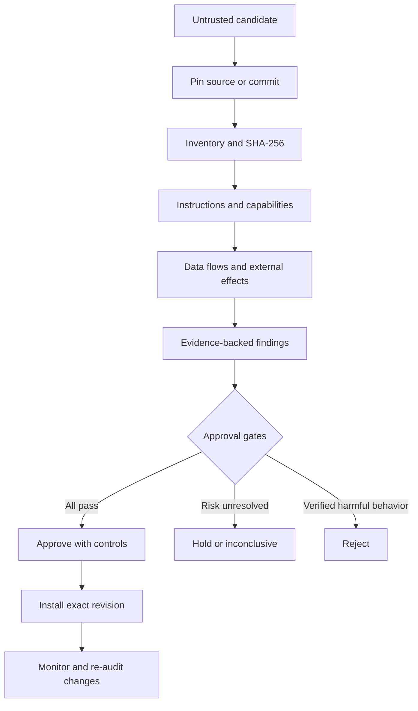

# Skill Safety Audit

Evidence-based security review for AI skills, agent packages, MCP connectors, local folders, ZIP archives, and source repositories **before installation or permission expansion**.

> **Security position:** this project reduces uncertainty; it does not promise absolute safety. Automated static analysis never grants installation approval on its own.

## Why this exists

AI skills are not only documentation. A package may combine instructions, scripts, tool declarations, lifecycle hooks, dependencies, binaries, remote endpoints, update logic, and access to sensitive user data. Reviewing only `SKILL.md` or trusting a popular repository leaves important execution paths unexamined.

Skill Safety Audit creates a repeatable trust decision based on:

- immutable source identification;
- complete file inventory and SHA-256 evidence;
- instruction and prompt-integrity review;
- tool, MCP, permission, and data-flow mapping;
- script, binary, lifecycle-hook, and persistence analysis;
- dependency and supply-chain review;
- explicit limitations, controls, and re-audit triggers.

## Core capabilities

| Area | What is reviewed |
| --- | --- |
| Instructions | Prompt injection, authority conflicts, hidden directives, audit bypass, and self-modification |
| Code | Python AST capabilities, shell/JavaScript risk patterns, file access, command execution, and dynamic loading |
| Secrets | Private keys, credential-like literals, token patterns, and redacted fingerprints |
| Supply chain | Manifests, lockfiles, lifecycle hooks, remote dependencies, workflows, and update/bootstrap paths |
| Tools and MCP | Tool declarations, connector authority, external destinations, and least-privilege requirements |
| Packages | Directories and ZIP files, including traversal, duplicate entries, symlinks, encrypted entries, and compression-bomb indicators |
| Platform artifacts | Escalation paths for Windows, macOS, Linux, Android, and iOS/iPadOS payloads |
| Re-audits | Baseline comparison for added, removed, modified, and unchanged files |

The scanner uses only the Python standard library, performs no candidate network requests, does not import candidate code, and does not extract ZIP contents to disk.

## Trust model



The detailed mind map is available in [`references/mental-model.md`](references/mental-model.md).

## Repository structure

```text
skill-safety-audit/
├── SKILL.md                         Skill entry point and mandatory boundaries
├── agents/openai.yaml               User-facing skill metadata
├── scripts/
│   ├── audit_skill.py               Read-only static scanner
│   └── self_test.py                 Safe synthetic behavioral tests
├── references/
│   ├── methodology.md               Evidence, severity, approval, and reporting model
│   ├── mental-model.md              Mermaid mind map and decision flow
│   ├── platform-escalation.md       Windows/macOS/Linux/Android/iOS escalation
│   ├── t3mp3st-adaptation.md        Defensive governance concepts adapted from T3MP3ST
│   └── usage.md                     Installation and operational examples
├── SECURITY.md                      Vulnerability reporting policy
└── CONTRIBUTING.md                  Contribution and test requirements
```

## Requirements

- Python 3.10 or newer for the local scanner.
- Codex/ChatGPT with skill support for `$skill-safety-audit` invocation.
- Git only when installing from this repository.

No third-party Python packages are required.

## Installation

### macOS or Linux

```bash
git clone https://github.com/MetaNetMx/skill-safety-audit.git \
  ~/.codex/skills/skill-safety-audit
```

### Windows PowerShell

```powershell
git clone https://github.com/MetaNetMx/skill-safety-audit.git `
  "$env:USERPROFILE\.codex\skills\skill-safety-audit"
```

Open a new Codex/ChatGPT turn after installation. For a reproducible deployment, audit and pin a specific commit instead of trusting a moving branch.

## Use as an AI skill

Minimal invocation:

```text
Use $skill-safety-audit to audit this skill before installation:
<GitHub URL, ZIP, or local folder>

Do not execute or install it. Give me an evidence-based verdict and mandatory controls.
```

Professional invocation:

```text
Use $skill-safety-audit in static, read-only mode.
Pin the candidate to an immutable revision and inventory every shipped file.
Review instructions, scripts, dependencies, lifecycle hooks, MCP/tool permissions,
secrets, network destinations, binaries, workflows, and update paths.
Map reachable capabilities and data flows. Do not install or execute candidate code.
Return APPROVE WITH CONTROLS, HOLD / REVIEW REQUIRED, REJECT, or INCONCLUSIVE,
including evidence, confidence, limitations, controls, and re-audit triggers.
```

## Use the local scanner

Audit a directory or ZIP and write a human-readable report outside the candidate:

```bash
python3 scripts/audit_skill.py /path/to/candidate \
  --format markdown \
  --output /path/outside/candidate/audit-report.md
```

Generate machine-readable JSON:

```bash
python3 scripts/audit_skill.py /path/to/candidate \
  --format json \
  --output /path/outside/candidate/audit-report.json
```

Compare a new version with a previous JSON baseline:

```bash
python3 scripts/audit_skill.py /path/to/new-version \
  --format json \
  --baseline /path/to/previous-audit-report.json \
  --output /path/outside/candidate/new-audit-report.json
```

The output path is intentionally rejected when it is inside the candidate. This preserves the candidate's read-only audit boundary.

## Verdicts

| Verdict | Meaning |
| --- | --- |
| `APPROVE WITH CONTROLS` | Manual evidence review passed every gate for one exact revision and permission set |
| `HOLD / REVIEW REQUIRED` | Sensitive or ambiguous behavior needs resolution or controlled testing |
| `REJECT` | Malicious, unauthorized, destructive, deceptive, or exfiltration behavior is verified |
| `INCONCLUSIVE` | Provenance, inventory, reachability, or other material evidence is incomplete |

`STATIC GATES PASSED — MANUAL REVIEW REQUIRED` is a scanner result, not an installation approval.

## Verification

Run the safe synthetic test suite:

```bash
python3 -B scripts/self_test.py
```

The tests cover:

- a benign skill;
- adversarial instructions;
- an npm lifecycle hook and unlocked dependency;
- secret detection without leaking the raw value;
- ZIP path traversal;
- delta comparison between revisions.

## Security boundaries and limitations

- Static analysis cannot prove that malicious or time-gated behavior is absent.
- Remote dependencies and services are identified but not executed or automatically trusted.
- Pattern matches are review leads; context and reachability determine their meaning.
- Native or opaque binaries require platform-specific escalation.
- Approval is valid only for the reviewed content hash/commit and stated permissions.
- Every changed dependency, tool, endpoint, binary, workflow, or update path triggers re-audit.

Read [`references/methodology.md`](references/methodology.md) for the full evidence and approval model.

## Defensive adaptation from T3MP3ST

This project incorporates high-level defensive governance ideas from [T3MP3ST](https://github.com/elder-plinius/T3MP3ST): scope receipts, tool gates, evidence ledgers, finding ledgers, retesting, and human-reviewed learning. It does **not** copy T3MP3ST source code or include its offensive capabilities.

## Responsible use

Audit only packages and repositories you are authorized to inspect. Do not use real credentials in tests. Any dynamic execution requires a disposable lab, synthetic data, restricted egress, snapshots, explicit approval, and a defined stop condition.

See [`SECURITY.md`](SECURITY.md) for vulnerability reporting.

## License

No software license has been declared yet. Public visibility does not grant reuse, modification, or redistribution rights beyond those provided by applicable law. The repository owner should select a license before inviting third-party redistribution.
