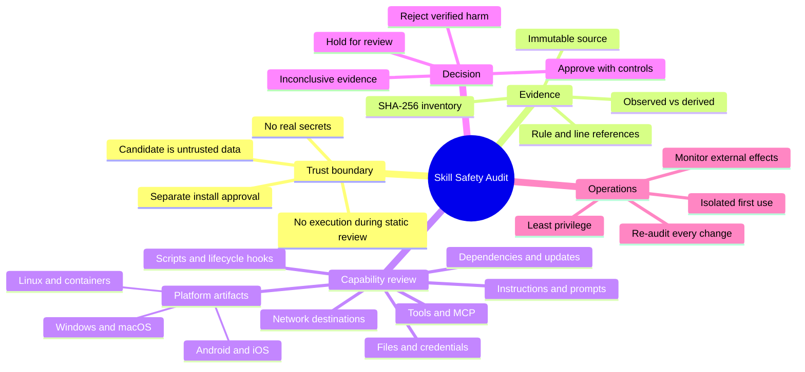
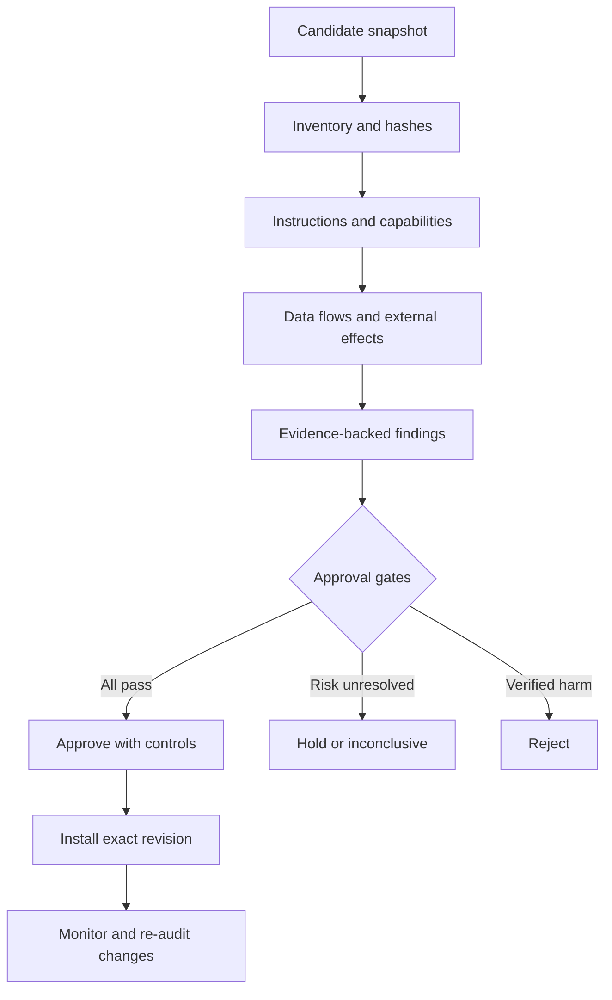

# Skill Safety Audit — Mental Map

The central idea is a chain of proof:

“No alert” is not the same as “safe.” Trust comes from complete evidence, bounded capability, explicit controls, and a version-specific decision.
